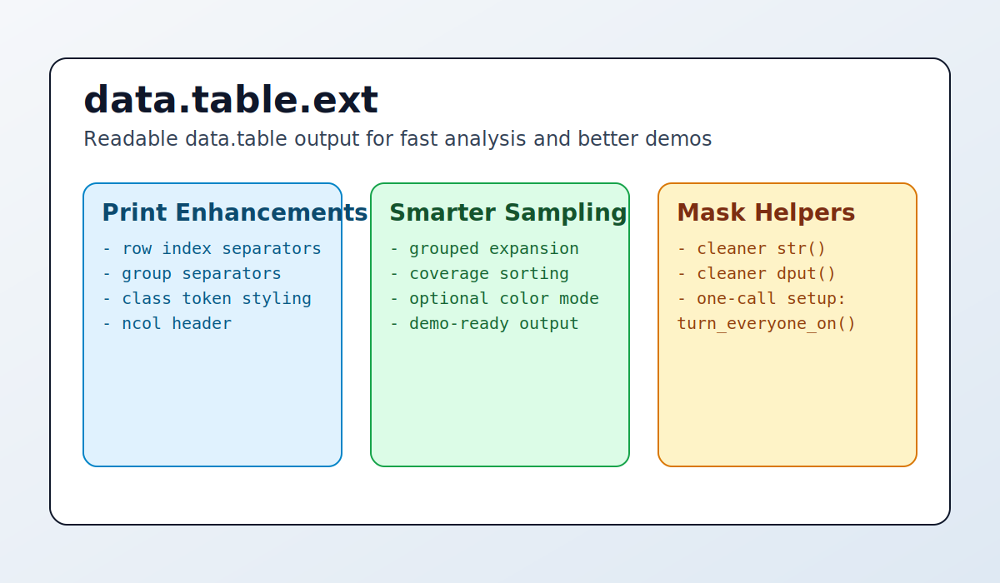
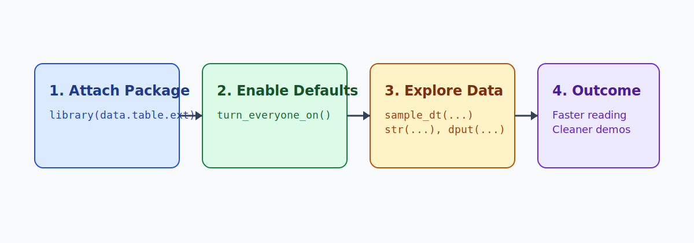

# data.table.ext

`data.table.ext` is a focused utility package for making `data.table` exploration easier to read, easier to scan, and easier to demo.

It does this in three big ways:

1. It upgrades print ergonomics for large tables.
2. It makes grouped sampling much more presentation-friendly.
3. It smooths `str()` and `dput()` output for `data.table` objects.



## Why this package exists

Raw `data.table` output is already very fast and practical, but when you are:

- demoing results to teammates,
- reviewing sampled cohorts,
- debugging mixed-type tables,
- or copying console output into docs,

small readability improvements can save a lot of time.

`data.table.ext` is opinionated about that readability layer.

## Benefits in practice

### 1) Improved print readability

`enable_dt_print_thousands()` adds row-index thousands separators, keeps alignment stable, and can display a compact `ncol:` header. On grouped samples, it can insert visual group separators and optional value coloring to surface patterns quickly.

This means large outputs are easier to parse at a glance, especially during exploratory work.

### 2) Better grouped sampling for demos and triage

`sample_dt()` supports two modes:

- simple row sampling (`group = NULL`),
- sampled-group expansion (`group = ...`) that returns all rows for sampled groups.

For grouped output, the table is sorted by group and tagged so print output can draw clear separators. This is useful for QA sessions, stakeholder walk-throughs, and quick anomaly checks.

### 3) Cleaner object introspection and reproducibility output

- `enable_dt_str_mask()` makes `str()` output for `data.table` more compact and readable.
- `enable_dt_dput_mask()` removes `.internal.selfref` noise from `dput()` output.

You get more signal and less structural clutter.

### 4) One-call setup

If you want everything enabled for your current session:

```r
library(data.table.ext)
turn_everyone_on()
```

That call enables print masking, `str()` masking, `dput()` masking, and default colored grouped sampling.

## Installation

From a local checkout:

```r
install.packages(".", repos = NULL, type = "source")
```

Or with `devtools`:

```r
devtools::install_local(".")
```

## Quick usage

```r
library(data.table)
library(data.table.ext)

turn_everyone_on()

DT <- as.data.table(iris)
DT[, grp := Species]

sample_dt(DT, n = 2, group = grp)
str(DT)
dput(DT[1:2])
```

## Visual workflow



## Startup message

When the package is attached with `library(data.table.ext)`, it prints a concise startup message describing the package purpose.

## Exported functions

- `enable_dt_print_thousands()`
- `disable_dt_print_thousands()`
- `enable_dt_str_mask()`
- `disable_dt_str_mask()`
- `enable_dt_dput_mask()`
- `disable_dt_dput_mask()`
- `sample_dt()`
- `set_null()`
- `switch_col()`
- `turn_everyone_on()`
