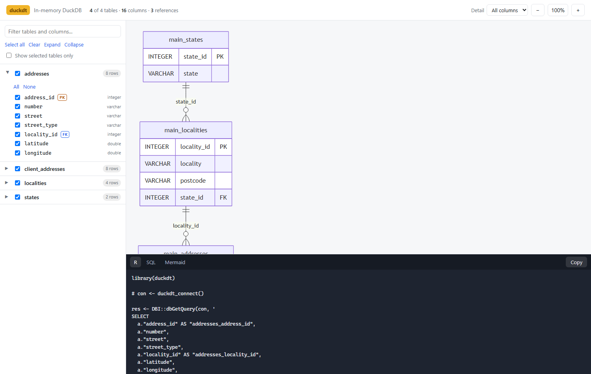

<style>
/* Mermaid draws at its natural size, which is small on a 1400px slide.
   Let each diagram use the full slide width, capped so it can't push the
   text off the bottom. */
.reveal svg[id^="mermaid"] {
  width: 100%;
  max-width: 100% !important;
  height: auto;
  max-height: 58vh;
}
.reveal figure > div { text-align: center; }

/* Output blocks (errors especially) can carry one very long line; wrap it
   rather than letting it run off the side of the slide. */
.reveal pre, .reveal pre code, .reveal .cell-output pre code {
  white-space: pre-wrap !important;
  word-break: break-word;
}
</style>

```{r}
#| label: setup
#| include: false
library(duckdt)
library(data.table)
source("demo-db.R")

# A small made-up address database, created fresh each time these slides are
# rendered. Four tables: states -> localities -> addresses, plus an inbound
# client file pointing at addresses.
con <- demo_address_db()
options(width = 90)
```

## The situation {.smaller}

We work with address data that is:

- **big** — the full address file is millions of rows,
- **relational** — addresses, localities, states, and whatever the client sent us,
- **queried the same way over and over** — count by locality, filter to a state,
  join a lookup on.

Two normal ways to handle that, each with a catch:

::: {.columns}
::: {.column width="50%"}
#### Load it into R

`fread()` the lot, then `data.table`.

*Syntax we know. Falls over when the file is bigger than memory.*
:::
::: {.column width="50%"}
#### Push it to a database

Write SQL, pull back results.

*Scales fine. Different language, and a slower loop.*
:::
:::

::: {.notes}
Set the scene with something the room recognises. Don't sell the package yet.
:::

## What `duckdt` is

> Write `data.table` code. It runs as SQL, inside DuckDB, over data that never
> has to fit in R's memory.

```{mermaid}
%%| echo: false
%%| fig-width: 9
flowchart LR
  A["Your R code<br/><code>d[state == 'WA', .N, by = locality]</code>"] --> B["duckdt<br/><i>translates</i>"]
  B --> C["DuckDB<br/><i>does the work</i>"]
  C --> D["A data.table<br/><i>just the answer</i>"]
  E[(".duckdb file<br/>.parquet / .csv")] --- C
```

The data stays put. Only the result comes back.

## Why DuckDB {.smaller}

::: {.columns}
::: {.column width="60%"}
- **In-process** — no server, no ports, no DBA. It's an R package:
  `install.packages("duckdb")`.
- **Built for analytics** — column-oriented, so "count by locality over 14
  million rows" is its home ground.
- **Reads files directly** — CSV and Parquet, without loading them first.
- **One file on disk** — a `.duckdb` file you can copy, back up, and share
  like any other file.
:::
::: {.column width="40%"}
Think of it as *SQLite for analysis*.

If you've used `fread()` on a 5 GB CSV and watched R struggle, DuckDB is the
part that stops it struggling.
:::
:::

::: {.notes}
Nobody needs to install or configure a database server. That's usually the
question here.
:::

## The one idea to take away

`data.table`'s three slots mean the same thing they always did:

::: {.columns}
::: {.column width="50%"}
#### You write

```r
d[state == "WA",
  .(n = .N),
  by = locality]
```
:::
::: {.column width="50%"}
#### duckdt sends

```sql
SELECT locality, count(*) AS n
FROM addresses
WHERE state = 'WA'
GROUP BY locality
```
:::
:::

<br>

`i` = which rows &nbsp;·&nbsp; `j` = what to return &nbsp;·&nbsp; `by` = grouped how

::: {.notes}
If they remember one slide, this is it. The mental model doesn't change.
:::

## What happens when you hit enter

```{mermaid}
%%| echo: false
%%| fig-width: 10
flowchart LR
  A["<code>d[i, j, by]</code>"] --> B["duckdt reads<br/>the expression"]
  B --> C["Builds one<br/>SQL statement"]
  C --> D["DuckDB scans<br/>only what it needs"]
  D --> E["Result comes back<br/>as a data.table"]
```

Every `[` runs **immediately** and gives you a real `data.table` — so you can
keep chaining, `print()`, `plot()`, or hand it to anything else, exactly as
usual.

## The steps {background-color="#1e2430" .center}

### Connect → Look → Wrap → Query → Get out

## Step 1 — Connect {.smaller}

```r
library(duckdt)

con <- duckdt_connect("C:/temp/addresses.duckdb")
#> ✔ Connected to DuckDB: C:/temp/addresses.duckdb
#> ℹ 4 tables: "addresses", "client_addresses", "localities", "states"
#> → `duckdt_erd(con)` to explore the tables and how they connect
#> → `duckdt(con, "addresses")` to query one with data.table syntax
```

- Forward slashes are fine on Windows.
- `read_only = TRUE` for a file you only mean to look at (and so others can
  open it at the same time).
- No path at all — `duckdt_connect()` — gives you a scratch database in memory.
- Finished: `duckdt_disconnect(con)`.

::: {.notes}
The message is the point: it tells you what you just opened and what to type
next. Nobody has to remember the introspection function names.
:::

## Step 2 — Look at what's in there {.smaller}

```{r}
duckdt_tables(con)
```

<br>

```{r}
duckdt_schema(con, table = "addresses")
```

::: {.notes}
Both come back as plain data.tables, so they chain: e.g.
duckdt_schema(con)[primary_key == TRUE].
:::

## Step 2 — ...and how the tables connect

```{r}
duckdt_relationships(con)
```

This is read off the database's own **foreign keys** — the constraints
declared when the tables were built. It's not guessing from column names.

::: {.notes}
Flag the caveat now, because most DuckDB files built from CSV loads have no
foreign keys at all. Slide after next covers what to do then.
:::

## Step 3 — See it

`duckdt_erd(con)` opens a diagram of the whole database in your browser:

```{mermaid}
%%| echo: false
%%| fig-width: 11
erDiagram
  direction LR
  states ||--o{ localities : "state_id"
  localities ||--o{ addresses : "locality_id"
  addresses ||--o{ client_addresses : "address_id"
```

Five seconds to answer "what have we actually got, and what joins to what".

## Step 3 — The page is interactive {.smaller}

{fig-align="center" width="82%"}

Tick tables and columns → the diagram redraws → **the code to select exactly
those is written for you**, joins and all, with a copy button.

::: {.notes}
This is the bit worth demoing live. The R tab gives duckdt code for one table
and a joined SELECT for several.
:::

## When the database has no foreign keys {.smaller}

Most DuckDB files built from CSV or Parquet declare none — so the diagram
would be a set of disconnected boxes. Two fixes:

::: {.columns}
::: {.column width="50%"}
#### Let it guess

```r
duckdt_erd(con, infer_references = TRUE)
```

`locality_id` → `localities.locality_id`.

Conservative: skips ambiguous names, a bare `id`, and columns whose types
don't match.
:::
::: {.column width="50%"}
#### Or say it exactly

```r
dm <- duckdt_data_model(con)
dm <- duckdt_dm_add_references(
  dm,
  addresses$locality_id ==
    localities$locality_id
)
duckdt_erd(dm)
```
:::
:::

::: {.notes}
Worth a mention: the diagram is only as good as the keys. Inferring is a
starting point, not gospel.
:::

## Step 4 — Wrap a table

```{r}
d <- duckdt(con, "addresses")
d
```

A `duckdt` handle is just a pointer: *this connection, that table*. Nothing is
copied, nothing is loaded. `nrow(d)`, `names(d)`, `head(d)` all work.

::: {.notes}
Note the "(read-only)" in the print output — covered in a couple of slides.
:::

## Step 5 — Query it {.smaller}

::: {.columns}
::: {.column width="50%"}
Filter rows — `i`

```{r}
d[street == "HAY"]
```
:::
::: {.column width="50%"}
Pick columns — `j`

```{r}
d[locality_id == 2,
  .(address_id, number, street)]
```
:::
:::

## Step 5 — Group and summarise {.smaller}

```{r}
d[, .(n = .N), by = street_type]
```

<br>

```{r}
d[, .(n = .N, mid_lat = round(mean(latitude), 3)), by = locality_id]
```

Each of these is one `SELECT ... GROUP BY` inside DuckDB. Only these few rows
travel back to R.

## Step 5 — Text matching {.smaller}

The inbound client file is free text — exactly the messy half of the job:

```{r}
cd <- duckdt(con, "client_addresses")
cd[raw_address %ilike% "fremantle", .(client_id, raw_address)]
```

::: {.smaller}
- `%like%` / `%ilike%` — regular expressions (case-sensitive / not)
- `%flike%` — plain substring, no regex
- `%in%`, `%between%`, `is.na()`, `&`, `|`, `!`, arithmetic — all as usual
:::

::: {.notes}
Same operators as data.table, running as DuckDB regex functions over the whole
table without pulling it into R.
:::

## Step 6 — Getting the data out

```{r}
result <- d[locality_id == 1, .(address_id, number, street, street_type)]
class(result)
```

Every `[` already returns a `data.table`. For the whole table:

```{r}
#| eval: false
as.data.table(d)     # SELECT * — the lot, into memory
```

```{r}
head(d, 3)           # or just a peek
```

## Two more things {background-color="#1e2430" .center}

### Joining, and writing

## Joining tables {.smaller}

The explorer wrote this for us; `duckdt_dm_query()` is the same thing from the
console. It works out the joins from the keys:

```{r}
dm <- duckdt_data_model(con)
sql <- duckdt_dm_query(
  dm,
  tables  = c("addresses", "localities", "states"),
  columns = list(addresses = c("number", "street"),
                 localities = "locality", states = "state")
)
cat(sql)
```

## Joining tables — running it

```{r}
setDT(DBI::dbGetQuery(con, sql))[1:4]
```

::: {.notes}
The point isn't that duckdt writes magic SQL — it's that you didn't have to
remember which column joins to which.
:::

## Writing — with a seatbelt {.smaller}

`:=` adds or updates a column **in the database**. Try it on the handle we
already have and it refuses:

```{r}
#| error: true
cd[, raw_upper := toupper(raw_address)]
```

Handles from `duckdt(con, table)` are **read-only by default** — a guard
against changing a table you only meant to look at. Opt in when you mean it:

```{r}
#| output: false
w <- duckdt(con, "client_addresses", writable = TRUE)
w[, raw_upper := toupper(raw_address)]
```

```{r}
w[, .(client_id, raw_upper)][1:3]
```

::: {.notes}
The column is now in the database, not in an R copy. Reconnect tomorrow and
it is still there.
:::

## Getting data *in* {.smaller}

```{mermaid}
%%| echo: false
%%| fig-width: 10
flowchart TD
  A["What have you got?"] --> B["A data.frame<br/>in R"]
  A --> C["A .csv / .parquet<br/>file"]
  A --> D["A table already<br/>in the database"]
  B --> B1["<code>as.duckdt(x)</code><br/>zero-copy view"]
  B --> B2["<code>as.duckdt(x, copy = TRUE)</code><br/>written into DuckDB"]
  C --> C1["<code>duckdt_csv(path)</code><br/><code>duckdt_parquet(path)</code>"]
  D --> D1["<code>duckdt(con, 'name')</code>"]
```

`duckdt_csv("addresses/*.csv")` makes a lazy view — the file isn't read until
a query needs it, and then only the parts it needs.

## Merging a subset back in {.smaller}

`duckdt_merge()` updates matching rows and inserts new ones — the whole thing
happens inside the database, so the big table never comes back to R:

```{r}
#| eval: false
fixed <- data.table(client_id = c(7, 9),
                    address_id = c(107L, NA_integer_))

duckdt_merge(w, fixed, by = "client_id")   # update matches, insert new rows
```

Useful for the corrections file that always follows a match run.

## Wrapping up {background-color="#1e2430" .center}

## Worth knowing {.smaller}

::: {.columns}
::: {.column width="50%"}
#### Not supported (yet)

- Chained lazy queries — every `[` runs straight away.
- Row numbers in `i` (`d[1:5]`) — database tables have no fixed order; filter
  on a column instead.
- Grouped `:=` (`by=` together with a write).
:::
::: {.column width="50%"}
#### Keep in mind

- Row **order** isn't guaranteed without `order(...)`.
- The diagram only knows the keys the database declares (or that you tell it).
- `:=` rebuilds the table, so it won't run on a table that another table
  references, and it drops that table's own constraints.
- It also speaks **SQL Server**, if that's where your data lives.
:::
:::

## The whole thing on one slide {.smaller}

```r
library(duckdt)

con <- duckdt_connect("C:/temp/addresses.duckdb")   # 1. open
duckdt_erd(con)                                     # 2. see what's in it

d <- duckdt(con, "addresses")                       # 3. wrap a table

d[street_type == "ST", .N, by = locality_id]        # 4. query it
d[street %ilike% "hay"]

out <- d[locality_id == 1, .(address_id, number, street)]   # 5. take the result
                                                            #    (already a data.table)
duckdt_disconnect(con)                              # 6. done
```

<br>

::: {.callout-tip}
## Start here
`con <- duckdt_example()` builds a small database to play with, and
`duckdt_erd(con)` draws it. Nothing to download.
:::

## Questions

**Try it**

```r
# install.packages("remotes")
remotes::install_github("KyleHaynes/duck.d.datatable")

library(duckdt)
con <- duckdt_example()
duckdt_erd(con)
```

**Read it**

- `README.md` — the full tour
- `WORKFLOW.md` — saving a `data.table` to a file and coming back to it later
- `?duckdt_erd`, `?duckdt_explorer` — the visual side

```{r}
#| include: false
duckdt_disconnect(con)
```
